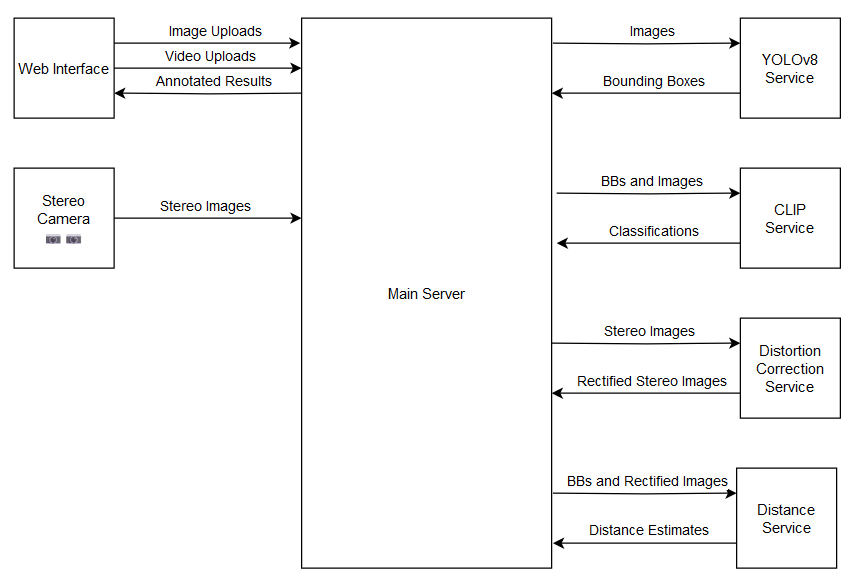
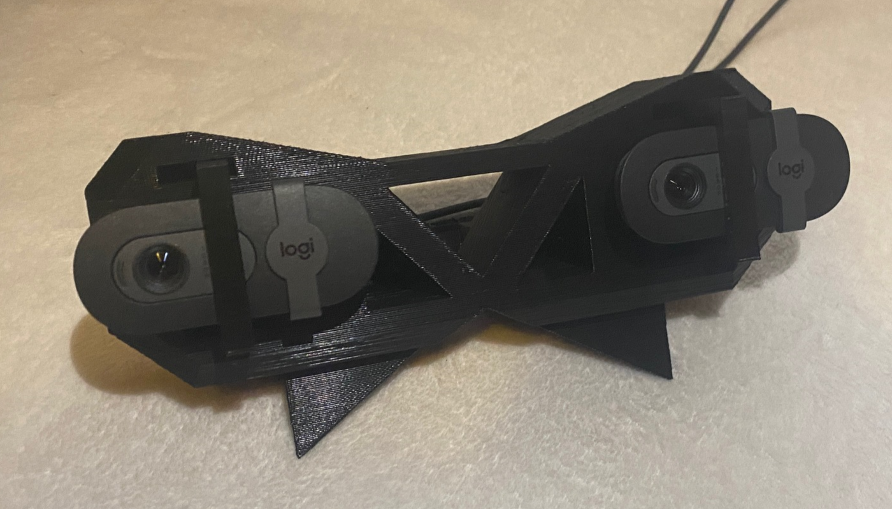
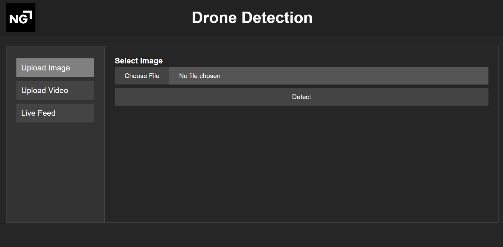
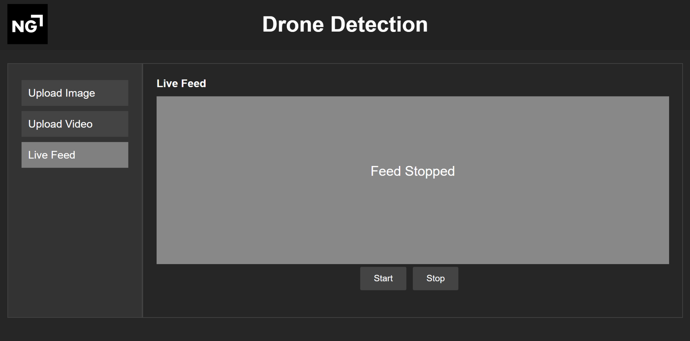
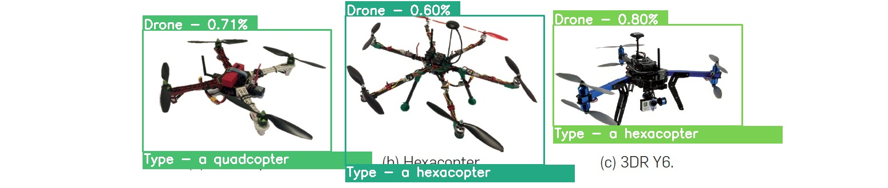
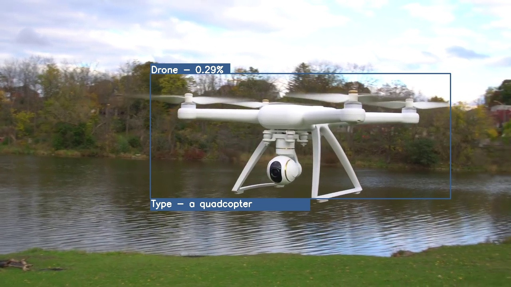
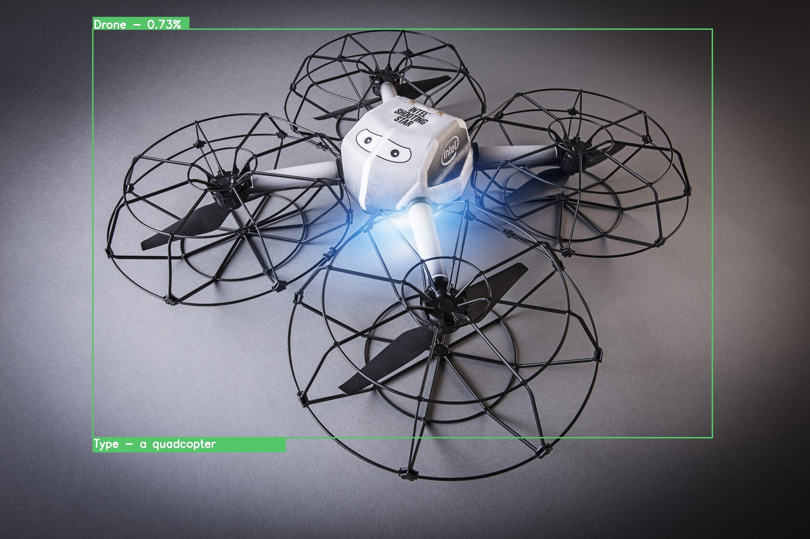
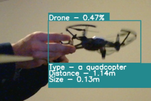
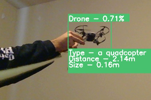

<!-- TABLE OF CONTENTS -->
<details>
  <summary>Table of Contents</summary>
  <ol>
    <li><a href="#challenge-overview">Challenge Overview</a></li>
    <li>
        <a href="#approach">Approach</a>
        <ol>
            <li><a href="#interface">Interface</a></li>
            <li><a href="#device">Device</a></li>
        </ol>
    </li>
    <li>
        <a href="#results">Results</a>
        <ol>
            <li><a href="#single-image-outputs">Single Image Outputs</a></li>
            <li><a href="#video-outputs">Video Outputs</a></li>
            <li><a href="#stereo-image-outputs">Stereo Image Outputs</a></li>
            <li><a href="#full-demo">Full Demo</a></li>
            <li><a href="#presentation">Presentation Slides</a></li>
        </ol>
    </li>
    <li><a href="#team">Team</a></li>
    <li><a href="#built-with">Built With</a></li></li>
    <li><a href="#getting-started">Getting Started</a></li>
  </ol>
</details>

# Challenge Overview
<h3>Northrop Grumman Drone Detection Challenge</h3>

This repository contains a Docker-based machine learning project aimed at addressing the Northrop Grumman Drone Detection Challenge. The goal of this project is to create and retrain an image recognition neural network capable of detecting and classifying small UAVs (drones) within an image.

Project Timeline \
Start Date: October 23, 2023 \
End Date: November 2, 2023

Our submission won first place in the challenge. 

<a href="https://ece.umd.edu/node/2131">Challenge Link</a>

# Approach

Our submission consisted of a business first approach. It included a web front end, a services based approach that leverages docker for modular code, different dependencies, easy deployment, and easy colaboration. The main service is able to invoke other services who have their own Flask web server over the local network.

## Pipeline


## Architecture
For more details about the architecture and individual services, check out our <a href="#presentation">presentation slides</a>.



## Device
Our device enables stereo tracking to extract more advanced information. CAD was used to design a housing to provide consistent camera location for stereo vision and distance metrics. We leverage two 1080p Logitech webcams in a custom 3D printed housing.



## Interface
Our interface aims to make our pipeline easy for any user to leverage to quickly access important information. It allows a user to upload images, upload videos, and use a webcam or webcams.




# Results
The below results are all from images and videos not seen at training time.

## Single Image Outputs




## Video Outputs
https://github.com/WillMeagher/Drone-Detection/assets/51809599/5101dc29-fbd1-4a43-a579-084c46915f79

## Stereo Image Outputs

These images are sample outputs from stereo camera inputs after run through the pipeline. The first image had the drone held at 1m away and for the second image the drone was held at 2m from the camera. The drone is roughly 0.16m across.




## Full Demo
<a href="https://drive.google.com/file/d/1JEmdeAz_NNIRpTJFQlh5UU6knH8GmnIs/view?resourcekey">Demo Video</a>

## Presentation
<a href="https://docs.google.com/presentation/d/13usl8mFhNhGrLMmp8mB0fuRR2R5I08cvBuRBrWUiUQY/edit?usp=sharing">Presentation Link</a>

# Team
This project was built by 3 University of Maryland students.
<ul>
    <li>Will Meagher</li>
    <li>Ethan Huegler</li>
    <li>Zoe Poppert</li>
</ul>

# Built With
* Python - Packages
    * Ultralytics - Yolo
    * OpenAI - Clip
    * Flask
    * Numpy
    * OpenCV
    * Requests
    * Sockets
    * Pillow
    * Matplotlib
* Docker
* Makefiles
* Jupyter Notebooks
* Javascript / HTML / CSS
* Fusion 360 (CAD)

<!-- GETTING STARTED -->
# Getting Started
## 0) System Requirements
This code requires a NVIDIA GPU to run and enough vram for the models. It was run on an RTX4070 with 16gb of vram. \
It has only been run and tested on Windows systems

## 1) Clone this repository

```sh
git clone https://github.com/WillMeagher/Drone-Detection.git
```

## 2) Configure the Environment

Copy the sample.env and rename it to .env
```sh
cp sample.env .env
```
Configure this file for your settings. You should only need to alter the DUAL_CAM and the CAM_ID settings. You may need to change the ports if there are conflicts.

## 3) Set up webcam server

### 3.0) Skip this step if you dont want use the webcam

### 3.1) Install local python dependencies for webcam/webcams
```sh
pip install -r .\camera-server-requirements.txt
```

### 3.2) Run the local webcam server
```python
python camera_server.py
```

## 4) Build the Code
```sh
make build
```

## 5) Run the Code
```sh
make run-gpu
```

## 6) Use the code

go to [localhost:5050](http://localhost:5050)
